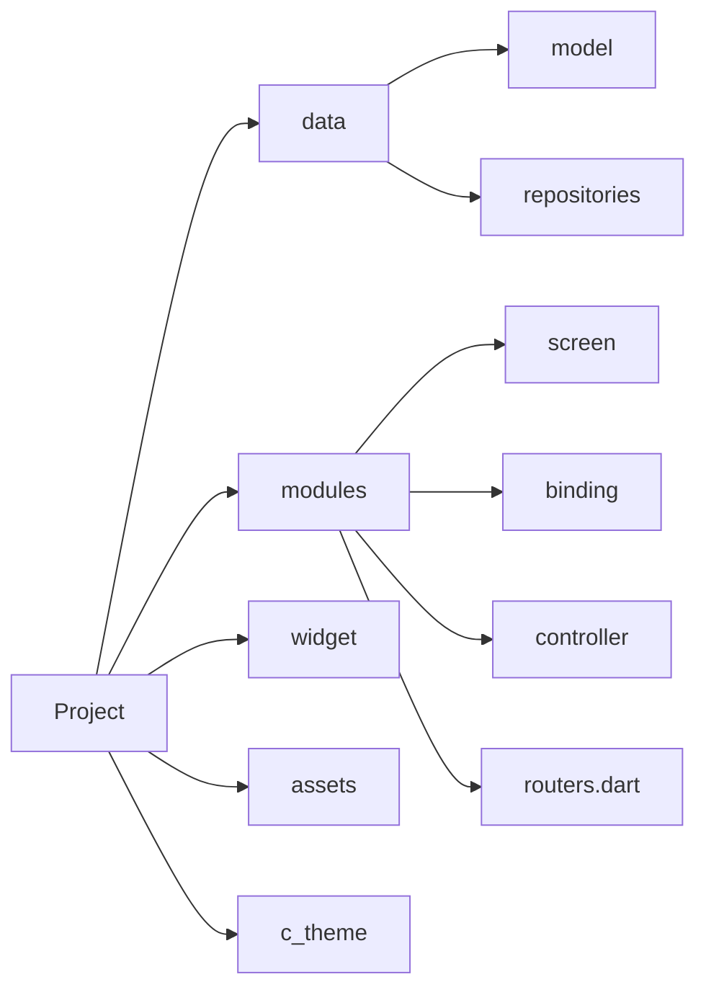

  
  

# OMIYAGE!

Ứng dụng quản lý bán hàng - Đồ án tốt nghiệp
> phát triển bởi:
>  - Vương Quang Huy
---

## Bản cài

Android: [OMIYAGE - Ứng dụng trên Google Play](https://play.google.com/store/apps/details?id=com.vqh2602.qlbh.quan_ly_ban_hang)

Ios: [OMIYAGE - Ứng dụng trên IOS, IPAD](https://testflight.apple.com/join/zLF3f7X1)

---

## Quản lý phiên bản bằng sidekick
[fluttertools/sidekick: A simple app to make Flutter development more delightful (github.com)](https://github.com/fluttertools/sidekick)

# Quy tắc github

  

  

1.  **Phát triển tính năng:**

  

Luôn tạo nhánh mới dừ develop, trước khi commit phải merge từ develop về để tránh khi merge tính năng vào dev bị confilic

  

2.  **Quy tắc đặt tên nhánh:**

  

feature/ < tên tính năng >

  

e.g: feature/fix_ui_bottomsheet

  

3.  **Yêu cầu comment giải thích code hàm sử lý để người sau có thể hiểu**

  

  

## Quy tắc project

  

  

1. Tên file, thư mục không được viết hoa

  

eg: detail_plant_screen.dart

  

2. Tên class viết hoa chữ cái đầu sau mỗi phân cách

  

eg: DetailPlantScreen

  

3. import thư viện hay file luôn luôn là dạng package

  

eg: **đúng**: import 'package:calories/c_theme/c_theme.dart'; **sai**: import './c_theme/c_theme.dart';

  

4. kích thước

  

hệ số của 4

  

5. icon:

  

https://lucide.dev/

  

6. commit code

  

trước khi commit chạy: flutter analyze để đảm bảo không còn lỗi hay cảnh báo nào

  

7. Tổ chức thư mục:

  

**data**: chứa thư mục con là **models** và **repositories**

  

*model*: chứa các đối tượng

  

*repositories*: quản lý tất cả các hàm gọi api trả về

  

**modules**: chứa 1 modul bao gồm 3 file *screen* , *binding*, *controller*, và file *routers.dart* quản lý tuyến đường

  

**widget**: chứa các widget con được viết thành hàm. mục đích để tái sử dụng ở các screen khác

  

**assets**: quản lý ảnh, video, ... được import vào

  

**c_theme**: quản lý custom theme

  

sơ đồ:

  

